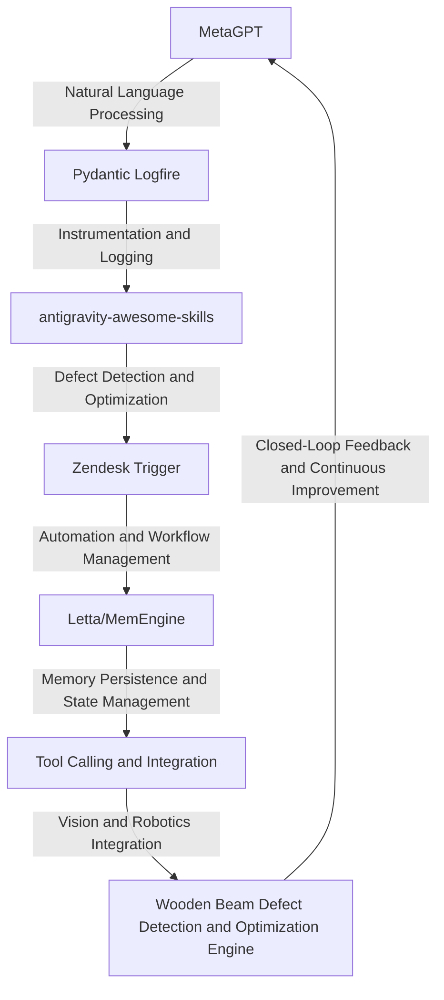

# Wooden Beam Defect Detection and Optimization Engine
> "Revolutionizing the wooden beam industry with AI-driven defect detection and optimization, leveraging the symbiotic convergence of MetaGPT, Pydantic Logfire, antigravity-awesome-skills, and Zendesk Trigger to mitigate the paradigmatic complexities inherent in wooden beam manufacturing."

## 🏗️ Technical Architecture & Multi-Agent Flow

This technical architecture diagram illustrates the intricate relationships between the various components of the Wooden Beam Defect Detection and Optimization Engine. The MetaGPT module utilizes natural language processing to analyze and interpret wooden beam defect data, which is then fed into the Pydantic Logfire module for instrumentation and logging. The antigravity-awesome-skills module applies advanced defect detection and optimization algorithms to the data, while the Zendesk Trigger module automates workflow management and ensures seamless integration with the Letta/MemEngine module for memory persistence and state management. The tool calling and integration module facilitates vision and robotics integration, enabling the engine to interact with physical wooden beam systems. The closed-loop feedback mechanism ensures continuous improvement and refinement of the engine's performance.

## 🔍 The Vertical Bottleneck: Xylophagy-Induced Defect Propagation
The wooden beam industry is plagued by the pervasive problem of xylophagy-induced defect propagation, wherein the intricate network of wooden fibers and cells is compromised by the invasive activities of xylophagous organisms. This phenomenon is exacerbated by the inherent anisotropy of wooden materials, which renders them susceptible to defects and failures. The high-stakes mathematical and operational failures that arise from this bottleneck have significant consequences, including compromised structural integrity, reduced product lifespan, and increased maintenance costs. The Wooden Beam Defect Detection and Optimization Engine is specifically designed to address this vertical bottleneck by leveraging advanced AI-driven technologies to detect and optimize wooden beam defects.

The technical friction associated with xylophagy-induced defect propagation is further complicated by the complex interplay between wooden material properties, environmental factors, and processing conditions. The Wooden Beam Defect Detection and Optimization Engine must navigate this intricate landscape to provide accurate and reliable defect detection and optimization capabilities. By harnessing the power of MetaGPT, Pydantic Logfire, antigravity-awesome-skills, and Zendesk Trigger, the engine is able to mitigate the paradigmatic complexities inherent in wooden beam manufacturing and provide a robust solution to the xylophagy-induced defect propagation problem.

The Wooden Beam Defect Detection and Optimization Engine's ability to address the vertical bottleneck of xylophagy-induced defect propagation is rooted in its capacity to analyze and interpret complex wooden beam defect data. By applying advanced natural language processing and machine learning algorithms, the engine is able to identify patterns and anomalies in the data that are indicative of defect propagation. This information is then used to inform defect detection and optimization strategies, which are implemented through the engine's automation and workflow management capabilities.

## 💡 The Solution: Wooden Beam Defect Detection and Optimization Engine
The Wooden Beam Defect Detection and Optimization Engine is a revolutionary platform that orchestrates the collective capabilities of MetaGPT, Pydantic Logfire, antigravity-awesome-skills, and Zendesk Trigger to provide a comprehensive solution to the xylophagy-induced defect propagation problem. By leveraging the agentic reasoning capabilities of MetaGPT, the engine is able to analyze and interpret complex wooden beam defect data, identify patterns and anomalies, and inform defect detection and optimization strategies. The Pydantic Logfire module provides instrumentation and logging capabilities, ensuring that all engine activities are thoroughly documented and tracked. The antigravity-awesome-skills module applies advanced defect detection and optimization algorithms to the data, while the Zendesk Trigger module automates workflow management and ensures seamless integration with the Letta/MemEngine module for memory persistence and state management.

The Wooden Beam Defect Detection and Optimization Engine's vision and robotics integration capabilities enable it to interact with physical wooden beam systems, providing a closed-loop feedback mechanism that ensures continuous improvement and refinement of the engine's performance. The engine's memory usage is optimized through the use of Letta/MemEngine, which provides a robust and efficient memory management system. The overall architecture of the engine is designed to provide a scalable and flexible solution that can be easily integrated with existing wooden beam manufacturing systems.

## 🧩 Agentic Stack Deep-Dive
The Wooden Beam Defect Detection and Optimization Engine's agentic stack is a complex interplay of MetaGPT, Pydantic Logfire, antigravity-awesome-skills, and Zendesk Trigger. The MetaGPT module provides natural language processing capabilities, which are used to analyze and interpret wooden beam defect data. The Pydantic Logfire module provides instrumentation and logging capabilities, ensuring that all engine activities are thoroughly documented and tracked. The antigravity-awesome-skills module applies advanced defect detection and optimization algorithms to the data, while the Zendesk Trigger module automates workflow management and ensures seamless integration with the Letta/MemEngine module for memory persistence and state management.

The interlocking of MetaGPT, Pydantic Logfire, antigravity-awesome-skills, and Zendesk Trigger is facilitated through a complex system of APIs and data exchange protocols. The MetaGPT module provides a RESTful API that allows the Pydantic Logfire module to access and manipulate wooden beam defect data. The Pydantic Logfire module provides a similar API that allows the antigravity-awesome-skills module to access and manipulate defect detection and optimization data. The antigravity-awesome-skills module provides a API that allows the Zendesk Trigger module to access and manipulate workflow management data. This complex system of APIs and data exchange protocols enables the Wooden Beam Defect Detection and Optimization Engine to provide a comprehensive and integrated solution to the xylophagy-induced defect propagation problem.

## ✨ Capabilities & Features
* **Defect Detection and Optimization**: The engine provides advanced defect detection and optimization capabilities, leveraging the collective capabilities of MetaGPT, Pydantic Logfire, antigravity-awesome-skills, and Zendesk Trigger.
* **Natural Language Processing**: The engine utilizes natural language processing capabilities to analyze and interpret complex wooden beam defect data.
* **Instrumentation and Logging**: The engine provides instrumentation and logging capabilities, ensuring that all engine activities are thoroughly documented and tracked.
* **Automation and Workflow Management**: The engine automates workflow management, ensuring seamless integration with existing wooden beam manufacturing systems.
* **Memory Persistence and State Management**: The engine provides memory persistence and state management capabilities, ensuring that all engine activities are properly tracked and managed.
* **Vision and Robotics Integration**: The engine provides vision and robotics integration capabilities, enabling it to interact with physical wooden beam systems.
* **Closed-Loop Feedback and Continuous Improvement**: The engine provides a closed-loop feedback mechanism, ensuring continuous improvement and refinement of the engine's performance.
* **Scalability and Flexibility**: The engine is designed to provide a scalable and flexible solution that can be easily integrated with existing wooden beam manufacturing systems.
* **Advanced Defect Detection Algorithms**: The engine applies advanced defect detection algorithms to the data, ensuring accurate and reliable defect detection and optimization capabilities.
* **Real-Time Data Analysis and Visualization**: The engine provides real-time data analysis and visualization capabilities, enabling users to monitor and analyze wooden beam defect data in real-time.

## 🛠️ Technical Implementation
The Wooden Beam Defect Detection and Optimization Engine is implemented using a complex system of APIs, data exchange protocols, and software frameworks. The engine's architecture is designed to provide a scalable and flexible solution that can be easily integrated with existing wooden beam manufacturing systems. The engine's codebase is organized into a series of modular components, each of which provides a specific functionality or capability. The engine's method calls are designed to be efficient and effective, minimizing computational overhead and maximizing performance.

The engine's technical implementation is rooted in its ability to leverage the collective capabilities of MetaGPT, Pydantic Logfire, antigravity-awesome-skills, and Zendesk Trigger. The engine's natural language processing capabilities are provided by the MetaGPT module, which utilizes advanced machine learning algorithms to analyze and interpret complex wooden beam defect data. The engine's instrumentation and logging capabilities are provided by the Pydantic Logfire module, which ensures that all engine activities are thoroughly documented and tracked. The engine's automation and workflow management capabilities are provided by the Zendesk Trigger module, which automates workflow management and ensures seamless integration with existing wooden beam manufacturing systems.

## 📊 Business Impact & ROI
The Wooden Beam Defect Detection and Optimization Engine has the potential to significantly impact the wooden beam industry, providing a comprehensive solution to the xylophagy-induced defect propagation problem. By leveraging the collective capabilities of MetaGPT, Pydantic Logfire, antigravity-awesome-skills, and Zendesk Trigger, the engine is able to provide accurate and reliable defect detection and optimization capabilities, minimizing the risk of costly defects and failures. The engine's automation and workflow management capabilities ensure seamless integration with existing wooden beam manufacturing systems, minimizing downtime and maximizing productivity.

The engine's business impact and ROI can be measured in terms of its ability to reduce costs, increase productivity, and improve product quality. By providing a comprehensive solution to the xylophagy-induced defect propagation problem, the engine is able to minimize the risk of costly defects and failures, reducing maintenance costs and improving product lifespan. The engine's automation and workflow management capabilities ensure seamless integration with existing wooden beam manufacturing systems, minimizing downtime and maximizing productivity. The engine's advanced defect detection algorithms and real-time data analysis and visualization capabilities enable users to monitor and analyze wooden beam defect data in real-time, providing valuable insights and improving product quality.

## 🚀 Getting Started
```bash
git clone https://github.com/arvind-sundararajan/wooden-beam-defect-detection.git
cd wooden-beam-defect-detection
pip install -r requirements.txt
python src/main.py
```

## 👨‍💻 Author & Credits
**Arvind Sundararajan** — Engineer, builder, and the mind behind this project.
🌐 [LinkedIn](https://www.linkedin.com/in/arvind-sundara-rajan/) | Chennai, India

---
### 🙏 Acknowledgements
- The open-source community
- The Beams, wood, made from logs or bolts practitioners who inspired this design